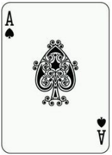
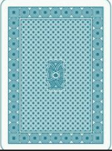
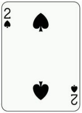
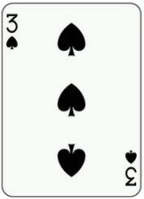
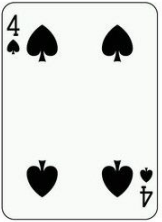
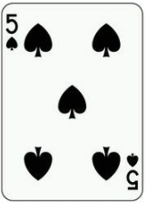
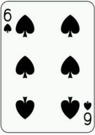

# memory-game
记忆小游戏
<!DOCTYPE html>
<html lang="en">
<head>
  <meta charset="UTF-8">

  <title>记忆小游戏</title>
  
  <link rel="stylesheet" href="styles.css">
 
</head>
<body>
        <audio autoplay="ture" loop="true"><source src="./1.flac"></audio>
  <section class="memory-game">
    

      
      
    

    

      
      
    

    

      
      
    

    

      
      
    

    

      
      
    

    

      
      
    

    

      
      
    

    

      
      
    

    

      
      
    

    

      
      
    

    

      
      
    

    

      
      
    

  </section>

  
</body>
</html>
